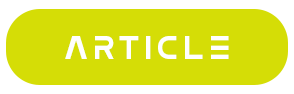

<!-- logo IMG -->
<p align="center">
    
  </a>
</p>

<!-- - --- --- --- Create -- --- --- ---  -->
## Create / Export 💙
**🐥 Create App Flutter**
1. Type these command for crete flutter project in CMD 

- `flutter create name_app`
  <details>

    >- `flutter create name_app`
    >- `flutter create --platforms ios,android name_app`

    > **Warning**
    > Use FVM only you installed .

    >- `fvm flutter create name_app`
    >- `fvm flutter create --platforms ios,android name_app`
  </details>

<!-- - --- --- --- Export -- --- --- ---  -->
**🐲 Export App Flutter**

1. If you want to export for Android

- `flutter build apk`
  <details>

    > **Warning**
    > Use for KEY in Android .

    ```
         storePassword=<password_de_clave>
         keyPassword=<password_de_alias>
         keyAlias=<name_de_alias>
         storeFile=<name_de_clave>.keystore
    ```
    >- `flutter build apk --release`
    >- `flutter build apk --target-platform android-arm,android-arm64`
  </details>


2. If you want to export for iOS

- `flutter build ios`
  <details>

    > **Warning**
    > Use for KEY in iOS .
    >- `open ios/Runner.xcworkspace`
  </details>

<!-- -- --- -- -- -- Setting-- --- -- --- --->
## Flutter Setting  ⚙️

>- Necessary tools for a Flutter 💙 developer.

<table align="center">
<tr>
  <td align="center"><a href="https://icon.kitchen/"><br /><sub><b> IconKitchen </b></sub></a><br /><a href="#maintenance-tbenning" title="@bastndev"></a></td>

  <td align="center"><a href="https://leonardo.ai/"><br /><sub><b> Leonardo.AI </b></sub></a><br /><a href="#maintenance-tbenning" title="@bastndev"></a></td>

  <td align="center"><a href="https://app.quicktype.io/"><br /><sub><b> Quicktype</b></sub></a><br /><a href="#maintenance-tbenning" title="@bastndev"></a></td>

  <td align="center"><a href="https://pub.dev/"><br /><sub><b> Pub-dev </b></sub></a><br /><a href="#maintenance-tbenning" title="@bastndev"></a></td>

  <td align="center"><a href="https://gitmoji.dev/"><br /><sub><b> Gitmoji </b></sub></a><br /><a href="#maintenance-tbenning" title="@bastndev"></a></td>

  <td align="center"><a href="https://iconscout.com/"><br /><sub><b> Iconscout </b></sub></a><br /><a href="#maintenance-tbenning" title="@bastndev"></a></td>

  <td align="center"><a href="https://lottiefiles.com/"><br /><sub><b> Lottie </b></sub></a><br /><a href="#maintenance-tbenning" title="@bastndev"></a></td>
</tr>
</table> 

<!-- -- --- -- -- -- Artificial Intelligence -- --- -- --- --->
``Artificial intelligence bank`` [Click](https://futureailab.com/)

``Claymorphism & Neumorphism :)`` [Click](https://hype4.academy/tools)

``fluttercomponent:)`` [Click](https://fluttercomponentlibrary.com/)

- *AI / English.*
  <details>

    > **Warning**
    > Artificial Intelligence.
    >- [Lexica](https://lexica.art/)
    >- [Future](https://futureailab.com/tools/)
    >- [ChatGPT](https://chat.openai.com/)
  </details>

  <details >

    > **Warning**
    > Learning English.
    >- [Free4talk](https://www.free4talk.com/)
    >- [Youglish](https://youglish.com/)
    >- [Busuu](https://www.busuu.com/)
  </details>

<!-- -- --- -- -- -- Artificial Intelligence -- --- -- --- --->
## People 🤙 
>Here you can recommend the tools to other developers, using the same forma, [font](https://www.dafontfree.io/groupe-font/) Thanks.[◾](https://www.figma.com/)[◼️](https://www.fontvalley.com/)[⚫](https://freedesignresources.net/download-in-progress/)

<div>
<!-- Audio -->
<a href="https://podcast.adobe.com/enhance ">  </a>
<!-- Image -->
<a href="https://replicate.com/nightmareai/real-esrgan">  </a>
<!-- Voice -->
<a href="https://beta.elevenlabs.io/">  </a>
<!-- Translate -->
<a href="https://www.rask.ai/?via=domingo">  </a>
<!-- writer -->
<a href="https://lex.page/">  </a>
<!-- Avatar -->
<a href="https://www.synthesia.io/?via=oskrleon">  </a>
<!-- chatBot -->
<a href="https://beta.character.ai/ ">  </a>
<!-- Article -->
<a href="https://escribelo.ai/?ref=jdzypf2yi">  </a>
<!-- Notion -->
<a href="https://www.notion.so/product/ai">  </a>
<!-- Cine -->
<a href="https://wonderdynamics.com/">  </a>
<!-- Animation -->
<a href="https://kaiber.ai/">  </a>
<!-- Others -->
<a href="https://firefly.adobe.com">  </a>

</div>

## Update Flutter 💙 VsCode
>- stable version desktop or pc vscode pls
```
flutter upgrade
```
>- FVM version update vscode pls
```
∘ fvm install 3.16.2 
∘ fvm global 3.16.2
```
`` fvm current``
>- FVM Tips
∘ fvm releases
∘ fvm use 3.16.2
∘ fvm list
∘ fvm flutter doctor
∘ fvm flutter --version
